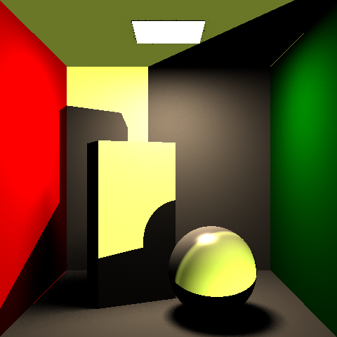

# CSE 168 HW2 extra credit

## Reduce Variance


## Point Light
- For point light, we use the formula $L_d(\omega_o) = \frac{I}{R^2} f(\omega_i, \omega_o)(n · \omega_i)V(\omega_i)$
- It's basically similar to the formula of area light, but change the random point we choose from the area to the position of the point light, and thus the incident direction would change. And we no longer need to use N, since their units are different, we use the radiance over the square of distance to ligth.
- right below is the original graph and left below is the graph produced by the cornell.test with adding a pointlight
```
point 0 0.44 2 0.8 0.8 0.8
```


- We can see that there is a white point on the sphere, the entire scene became a bit brighter, and on the background there are light shadows of the sphere and cube.

## Directional Light
- For directional light, we use the formula $L_d(\omega_o) = E f(\omega_i, \omega_o)(n · \omega_i)V(\omega_i)$, where $E = L_i \delta omega$. Thhis is also very similar to the area light but we do not use the area, and the incident direction became the oppsisete of direction of the light, and use the occulsion function of directional light.
- right below is the original graph and left below is the graph produced by the cornell.test with adding a directional light
```
directional -0.3 0.2 -0.5 0.8 0.9 0.3
```


- We make the light color yellow so that we can clearly see the effect
