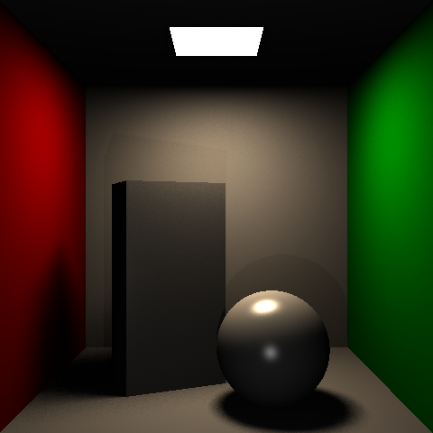
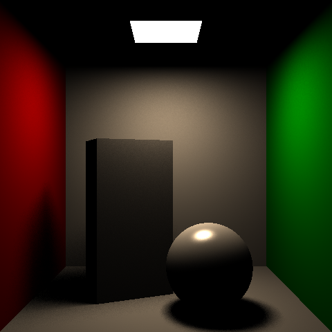

# CSE 168 HW2 extra credit

## reduce variance


## point light
- For point light, we use the formula $L_d(\omega_o) = \frac{I}{R^2} f(\omega_i, \omega_o)(n · \omega_i)V(\omega_i)$
- It's basically similar to the formula of area light, but change the random point we choose from the area to the position of the point light, and thus the incident direction would change. And we no longer need to use N, since their units are different, we use the radiance over the square of distance to ligth.
- right below is the orginal graph and left below is the graph produced by the cornell.text with adding a pointlight
```
point 0 0.44 2 0.8 0.8 0.8
```



- we can see that there is a white point on the sphere, the entire scene became a bit brighter, and on the background there are light shadows of the sphere and cube.
